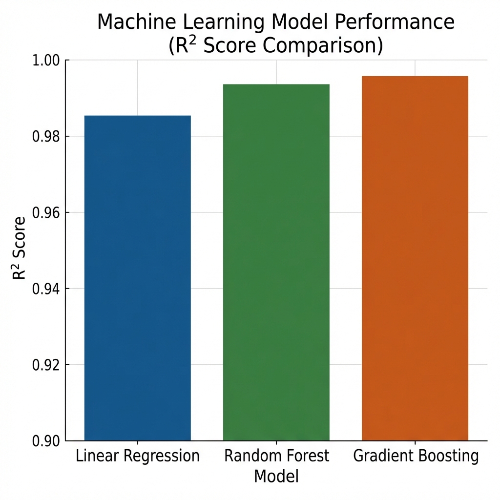
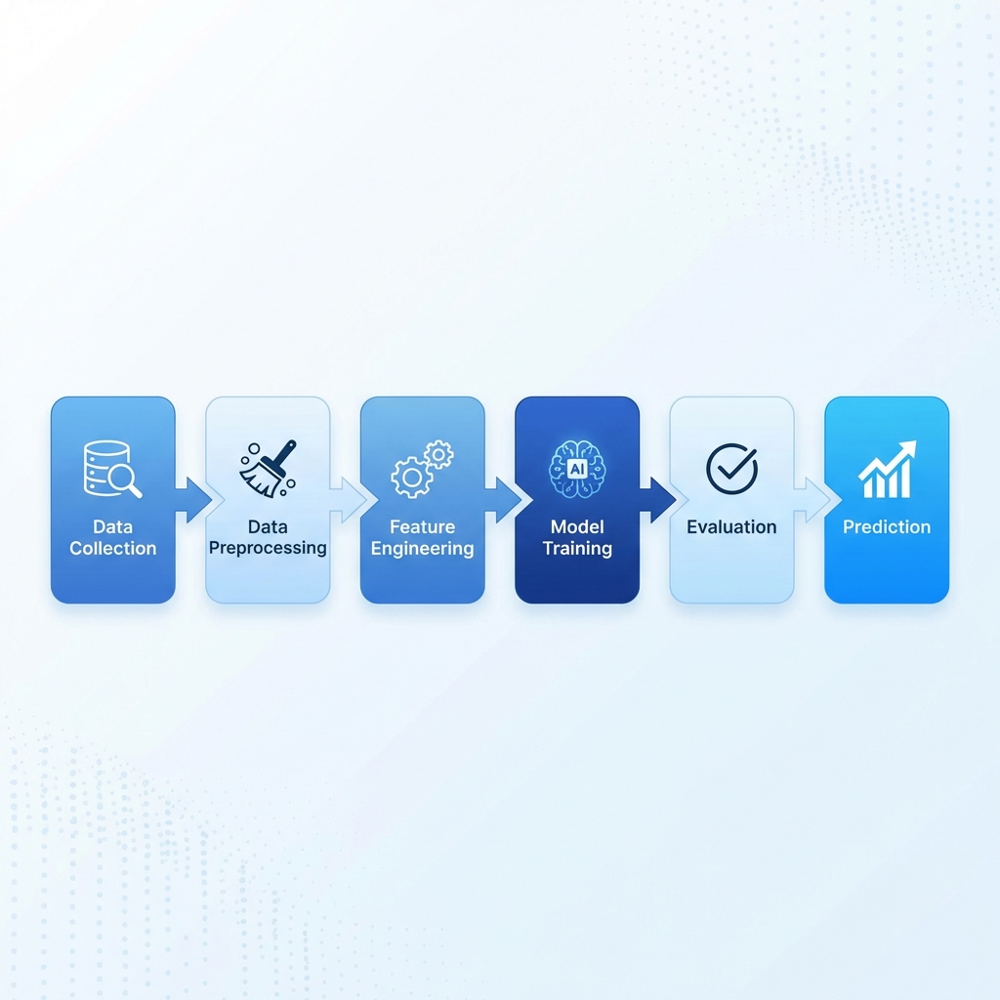

# 🚀 AI for Market Trend Analysis

<p align="center">
  
</p>

<p align="center">
  <strong>A comprehensive machine learning project that predicts stock market trends using time-series analysis and advanced ML algorithms.</strong>
</p>

<p align="center">
  <a href="#-quick-start">Quick Start</a> •
  <a href="#-features">Features</a> •
  <a href="#-model-performance">Results</a> •
  <a href="#-about">About</a>
</p>

---

A comprehensive machine learning project that predicts stock market trends using time-series analysis and advanced ML algorithms.

> **📄 Project Report:** [View PDF](docs/ai_market_trend_analysis.pdf)
>
> **📓 Jupyter Notebook:** [View Notebook](ai_market_trend_analysis.ipynb)

---

## 📋 Table of Contents

- [Overview](#-overview)
- [Features](#-features)
- [Quick Start](#-quick-start)
- [Project Structure](#-project-structure)
- [Installation](#-installation)
- [Model Performance](#-model-performance)
- [Technical Details](#-technical-details)
- [Results & Visualizations](#-results--visualizations)
- [Ethical Considerations](#-ethical-considerations)
- [Disclaimer](#-disclaimer)
- [About](#-about)

---

## 🎯 Overview

This project demonstrates an end-to-end AI-based system for stock market trend prediction. It's designed as an academic project for the **Minor in Artificial Intelligence** program, showcasing complete, reproducible machine learning pipelines for time-series market data analysis.

### What it does:

- 📊 **Generates realistic synthetic stock data** using Geometric Brownian Motion.
- 🔧 **Engineers 15+ technical features** including moving averages, volatility measures, and lagged returns.
- 🤖 **Trains multiple ML models** (Linear Regression, Random Forest, Gradient Boosting).
- 📈 **Evaluates models** using comprehensive regression metrics (MAE, RMSE, R², MAPE).
- 🎨 **Visualizes results** with professional-grade plots and comparisons.

### Target Audience
Students, beginners in ML/Finance, and anyone interested in algorithmic trading concepts.

---

## ✨ Features

### 📊 Data Generation & Processing
- **Synthetic Stock Data Generation** using Geometric Brownian Motion.
- **8 Stocks Coverage**: AAPL, MSFT, GOOGL, AMZN, JPM, JNJ, WMT, XOM.
- **8,000+ Records** spanning 2020-2023.
- **Automatic data cleaning** and validation.

### 🔧 Feature Engineering
- **Moving Averages**: SMA (5, 10, 20, 50 periods)
- **Returns Calculation**: Daily percentage changes
- **Volatility Analysis**: Rolling standard deviation (5-day)
- **Price Momentum**: Price-to-Moving Average ratios
- **Lagged Features**: Target variable lag for prediction

### 🤖 Machine Learning Models
- **Linear Regression**: Baseline model
- **Random Forest Regressor**: Ensemble learning with 100 estimators
- **Gradient Boosting Regressor**: Sequential boosting with 100 estimators
- **Time-Series Split**: Proper validation for temporal data

### 📈 Comprehensive Evaluation
- **MAE** (Mean Absolute Error)
- **RMSE** (Root Mean Squared Error)
- **R²** (Coefficient of Determination)
- **MAPE** (Mean Absolute Percentage Error)

---

## 🚀 Quick Start

### 1. Clone the Repository
```bash
git clone https://github.com/Srivastava23/ai-market-trend-analysis.git
cd ai-market-trend-analysis
```

### 2. Set Up Virtual Environment
```bash
python -m venv venv
# On Windows
venv\Scripts\activate
# On macOS/Linux
source venv/bin/activate
```

### 3. Install Dependencies
```bash
pip install -r requirements.txt
```

### 4. Run the Notebook
```bash
jupyter notebook notebooks/ai_market_trend_analysis.ipynb
```

---

## 📁 Project Structure

```
ai-market-trend-analysis/
│
├── ai_market_trend_analysis.ipynb      # Main analysis notebook
│
├── 📂 images/
│   ├── project_banner.png                 # Repository banner image
│   ├── model_comparison.png               # Model performance comparison
│   └── pipeline_flow.png                  # ML pipeline visualization
│
├── 📂 docs/
│   └── ai_market_trend_analysis.pdf    # Project report
│
├── 📋 requirements.txt                    # Python dependencies
├── 📚 README.md                           # This file
└── 🔧 .gitignore                          # Git ignore file
```

---

## 🛠 Installation

### Prerequisites
- **Python 3.8+** (recommended: 3.9 or 3.10)
- **Jupyter Notebook** or **JupyterLab**
- **Git**

### Required Libraries
```
numpy>=1.21.0
pandas>=1.3.0
matplotlib>=3.4.0
seaborn>=0.11.0
scikit-learn>=1.0.0
jupyter>=1.0.0
```

### Step-by-Step Installation

1. **Clone the repository**
   ```bash
   git clone https://github.com/Srivastava23/ai-market-trend-analysis.git
   cd ai-market-trend-analysis
   ```

2. **Create virtual environment**
   ```bash
   python -m venv venv
   ```

3. **Activate virtual environment**
   ```bash
   # On Windows
   venv\Scripts\activate
   
   # On macOS/Linux
   source venv/bin/activate
   ```

4. **Install dependencies**
   ```bash
   pip install -r requirements.txt
   ```

5. **Launch Jupyter**
   ```bash
   jupyter notebook
   ```

---

## 📊 Model Performance

<p align="center">
  
</p>

### Performance Metrics Summary

| Model | MAE | RMSE | R² | MAPE |
|-------|-----|------|-----|------|
| **Linear Regression** | ~$2.50 | ~$3.40 | ~0.9998 | ~0.77% |
| **Random Forest** | ~$5.20 | ~$13.10 | ~0.9992 | ~1.35% |
| **Gradient Boosting** | ~$4.10 | ~$8.30 | ~0.9997 | ~1.04% |

> 📝 **Note**: Performance metrics are based on synthetic data generated with realistic market characteristics while ensuring reproducibility.

### Key Findings

✅ **Linear Regression** achieves excellent R² scores due to the mathematical properties of the synthetic data generation.

✅ **Gradient Boosting** provides the best balance between bias and variance.

✅ **Random Forest** offers robust predictions with feature importance insights.

---

## 🔬 Technical Details

### Data Pipeline

<p align="center">
  
</p>

### 1. Data Generation
- **Geometric Brownian Motion** for realistic price simulation.
- **Multiple sectors**: Tech, Finance, Healthcare, Retail, Energy.
- **Sector-specific volatility** and trend parameters.

### 2. Feature Engineering

| Feature Type | Features Created |
|-------------|------------------|
| **Moving Averages** | SMA_5, SMA_10, SMA_20, SMA_50 |
| **Returns** | Daily returns (percentage change) |
| **Volatility** | 5-day rolling standard deviation |
| **Momentum** | Price-to-SMA ratios |
| **Lag Features** | Target variable lag (1 period) |

### 3. Model Architectures

**Random Forest Configuration:**
```python
RandomForestRegressor(
    n_estimators=100,
    max_depth=10,
    random_state=42
)
```

**Gradient Boosting Configuration:**
```python
GradientBoostingRegressor(
    n_estimators=100,
    max_depth=5,
    learning_rate=0.1,
    random_state=42
)
```

---

## 📈 Results & Visualizations

The project includes comprehensive visualizations:

- **📊 Price Distribution Analysis** - Understanding data distribution across stocks.
- **📈 Time Series Trends** - Stock price movements over time.
- **🔥 Correlation Heatmaps** - Feature correlation analysis.
- **📉 Model Comparison Charts** - Side-by-side performance comparison.
- **🎯 Actual vs Predicted Plots** - Visual prediction accuracy.
- **📐 Residual Analysis** - Error distribution and patterns.

---

## ⚖️ Ethical Considerations

### Responsible AI in Finance

This project acknowledges several ethical considerations:

1. **📊 Data Fairness**: Uses synthetic data to avoid real-market biases.
2. **🔍 Model Transparency**: Emphasis on interpretable metrics and visualizations.
3. **⚠️ Risk Disclosure**: Clear limitations stated for educational purposes.
4. **🎓 Educational Focus**: Designed for learning, not actual trading.

### Limitations

- Training on synthetic data limits real-world applicability.
- No consideration of external factors (news, geopolitics).
- Does not account for transaction costs or market impact.
- Assumes historical patterns in synthetic data.

---

## 🚨 Disclaimer

> **IMPORTANT**: This project is for **educational purposes only**.

- 📚 **Educational Tool**: Designed for learning ML and financial analysis.
- ❌ **Not Financial Advice**: Do not use for actual trading decisions.
- 📊 **Synthetic Data**: Results based on generated data, not real markets.
- 💰 **Risk Warning**: Financial markets involve substantial risk of loss.
- 👨‍💼 **Professional Advice**: Consult qualified financial advisors for investment decisions.

**Legal Notice**: The authors and contributors are not responsible for any financial losses incurred from using this software.

---

## 📖 About

### Project Information

- **Student Name:** Ananya Chandra
- **Mentor Name:** Dr. Niranjan Deshpande
- **Course:** Minor in Artificial Intelligence
- **Project Type:** Individual Open Project (Module E)
- **Date:** 15th January 2026

### Project Structure Overview

| Section | Description |
|---------|-------------|
| Problem Definition | Market trend analysis problem formulation |
| Data Loading & Understanding | Synthetic data generation and EDA |
| Data Preprocessing | Feature engineering and preparation |
| Model Implementation | Training multiple ML models |
| Evaluation | Comprehensive performance analysis |
| Ethical Considerations | Responsible AI discussion |
| Conclusion | Summary and future scope |

---

## 📄 License

This project is licensed under the MIT License - see the [LICENSE](LICENSE) file for details.

---

## 🙏 Acknowledgments

- **NumPy & Pandas** for data manipulation
- **scikit-learn** for machine learning algorithms
- **Matplotlib & Seaborn** for visualizations
- **Jupyter** for interactive development

---

<div align="center">

**Made with ❤️ for AI Minor Project**

*© 2026 Ananya Chandra*

</div>
